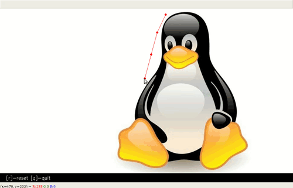

# multi-shape Cropper tool
* script allows selection of a main region then subregions within the main region , to select main region simply select points along the perimeter of what you want to crop then press enter. 
* sub region select has 3 modes ,viz elastic (similar to main region select), click and drag circle, click and drag square. 
* For elastic if more than one region is required press n to select a different area, for circle and square simply click and drag again press enter when done. 
* More info is presented on screen

